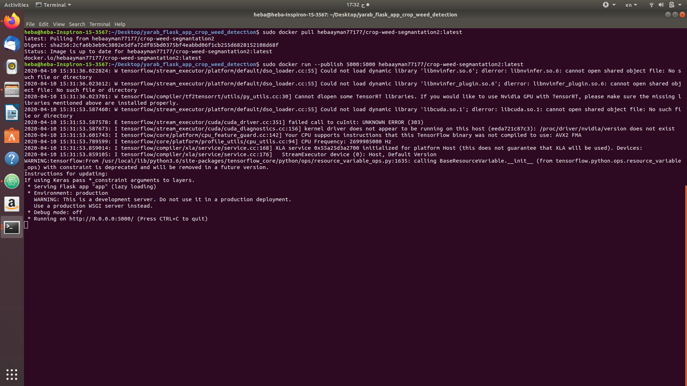
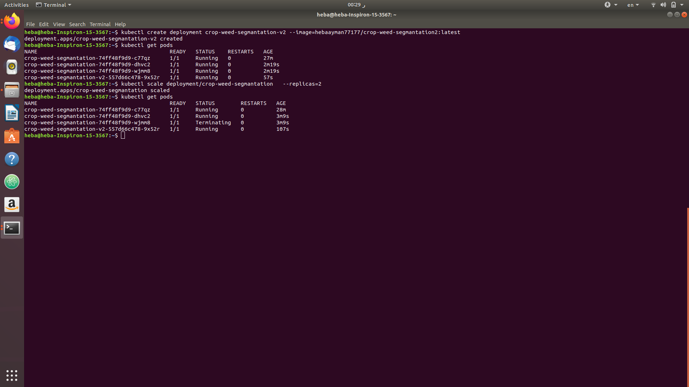
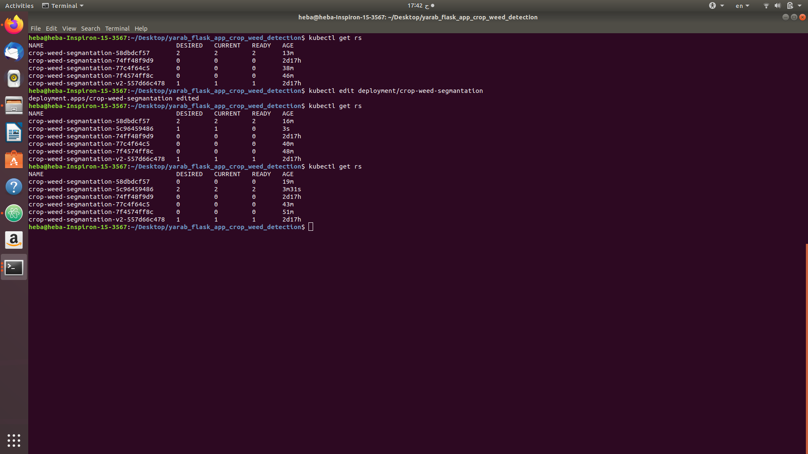
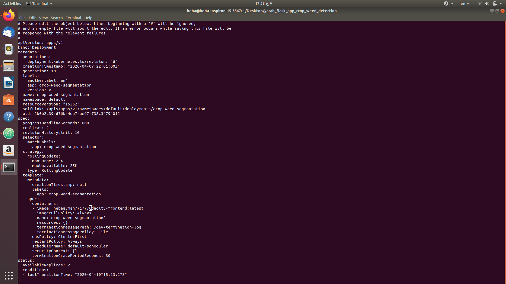
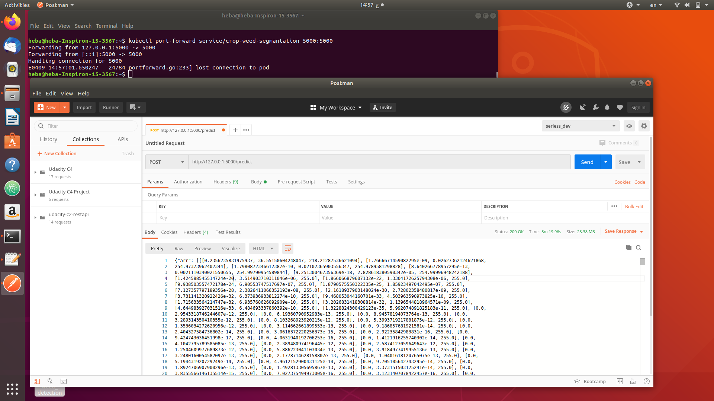

# About the project

The project consists of two parts:
- First generate the model that segment a crop weed images
- Second deploy the model as a microservice on a kubernetes cluster on AWS

for the first part Unet is trained on the data,
there were inconsistant of the training data also there were only 60 image
so two approaches were tried:
- first we tried to relabeling them automatically by detecting the areas of weed as they occupy large area while crop is thin using Dilation and Erosion
- the second approach is to relabeling them manually which gives better results


this part exists in crop_weed_segmantation.ipynb notebook

for the second part:
- I made an API to predict from the model in a flask app
- Then containerized it
- Then deploy it on a kubernetes cluster


##  How to setup and deploy the project


### 1. Pull the image
```
docker pull hebaayman77177/crop-weed-segmantation2:latest
```
### 2. To run


#### 2-1. In container on your local machine
```
docker run --publish 5000:5000 hebaayman77177/crop-weed-segmantation2:latest
```


#### 2-2. In Kubernetes cluster
 - first Create cluster, i created a cluster with one master node and 2 worker nodes
 - then create a deployment

  ```
   kubectl create deployment crop-weed-segmantation --image=hebaayman77177/crop-weed-segmantation2:latest
  ```
   this will create a deployment with one pod you can scale it
   ```
   kubectl scale deployment/crop-weed-segmantation --replicas=3
   ```


   - then create a service
   ```
   kubectl expose deployment/crop-weed-segmantation --port 5000
   ```


  - then run the service
  ```
  kubectl port-forward service/crop-weed-segmantation 5000:5000
  ```

  i have included a postman file that contain the request, you should get a 3d array of the segmented image


 ### A/B deployment of the application
 - i made a new deployment of the service
 - then deployed it
 - then i scaled down the old deployment


 


 ### Upgraded via rolling-update
- i can change the docker image of a deployment via rolling-update





 ## screenshots

 
 
